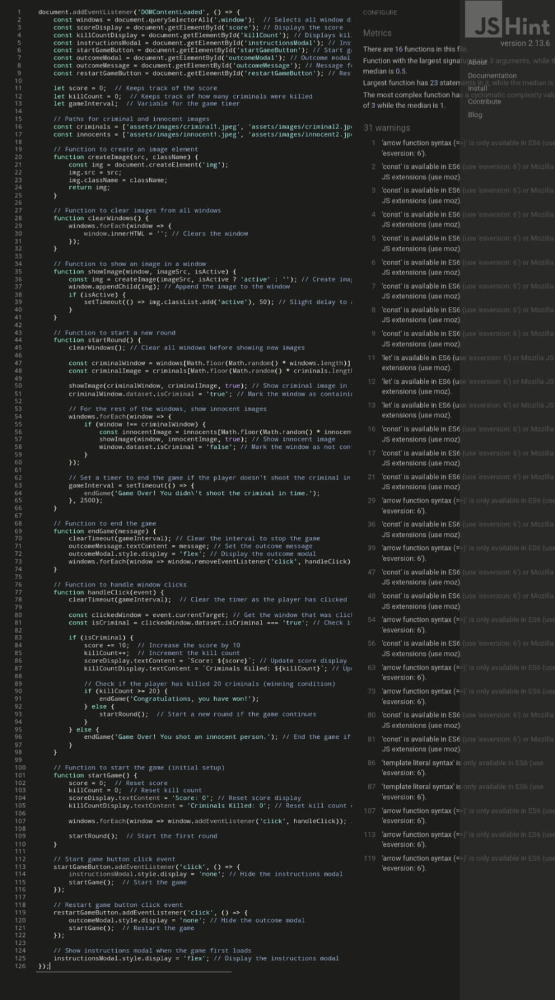
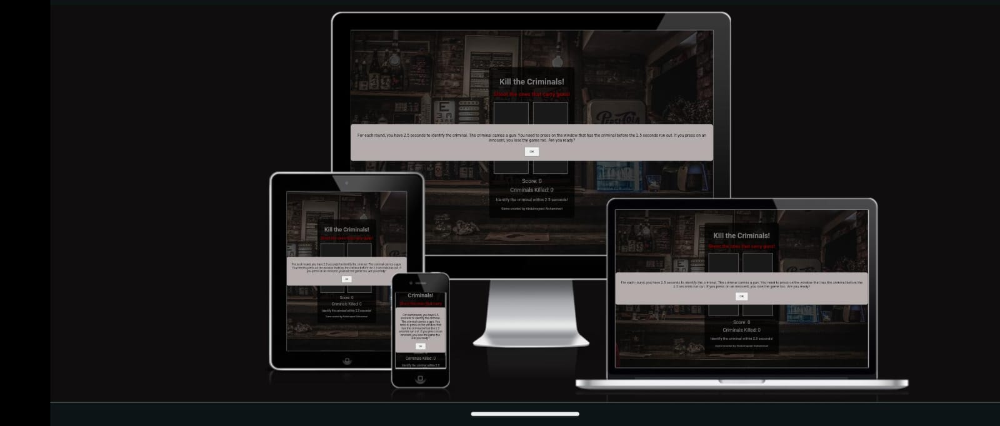

# Shoot the Criminals
"Shoot the Criminals" is an interactive web-based game where the objective is to identify and shoot the criminal. Each round, one criminal carrying a gun and three innocent civilians appear in four windows, and the player has 2.5 seconds to shoot the criminal. Shooting an innocent or failing to shoot the criminal within the time frame results in a loss.

# Detailed Game Description
The game is designed to test your reflexes and decision-making under pressure. You need to quickly identify the criminal (who is holding a gun) among the four windows. Each round becomes progressively faster and more challenging, with a time limit of 2.5 seconds per round. The objective is to reach 20 kills without shooting any innocent civilians.

# Game Features
#### Randomized Gameplay: 
Each round, the criminal appears in a random window.
#### 1. Score Tracking: 
Your score increases by 10 points with every correct shot.
#### 2. Win Condition: 
The player wins when they successfully shoot 20 criminals.
#### 3. Lose Condition: 
The game ends if the player shoots an innocent or fails to shoot within the 2.5 seconds limit.
#### 4. Interactive Modals: 
Instructions and game-over messages are shown in modal popups.

## Technologies Used
#### HTML5: 
Structure of the game interface.
#### CSS3: 
Styling for the game, including the modal popups, windows, and background.
#### JavaScript (ES6): 
Core game logic, event handling, and dynamic rendering of images.

## How to Play:
1: When the game starts, you will see four windows.

2: The game begins with an instruction modal explaining the rules. Press OK to start.

3: Every round, a criminal and three innocent civilians will appear in the windows. The criminal can be identified by the gun.

4: You have 2.5 seconds to click on the window containing the criminal. If successful, your score increases by 10 points, and a new round begins.

5: The game continues until you either kill 20 criminals (win) or shoot an innocent or fail to identify the criminal in time (lose).
If you lose, a game-over modal will pop up, allowing you to restart.

## Validation:

### HTML : 
I have tested my html file and found no errors: 
https://validator.w3.org/nu/?doc=https://transhumanistaj.github.io/Shoot-The-Criminals/index.html

### css:
I have tested my CSS file and found no errors:
https://jigsaw.w3.org/css-validator/validator?uri=https://transhumanistaj.github.io/Shoot-The-Criminals

### JavaScript:
I have tested my JavaScript below in the screenshot:

## Responsiveness :

## Further Testing:
 1: The Website was tested on Google Chrome, Internet Explorer, Microsoft Edge and Safari browsers.

2: The website was viewed on a variety of devices such as Desktop, Laptop, iPhone7, iPhone 8 & iPhoneX.

3: A large amount of testing was done to ensure that all pages were linking correctly.

## Credits
#### Game Developer: Abdulmajeed Alshammari
#### Images: 
1: The bar (background) image source: https://pixabay.com/photos/bar-drinks-alcohol-fridge-926256/

2: The criminal 1 & 2, innocent 1 & 2 images online free AI-image generator source: 
https://deepai.org/machine-learning-model/3d-character-generator  .

